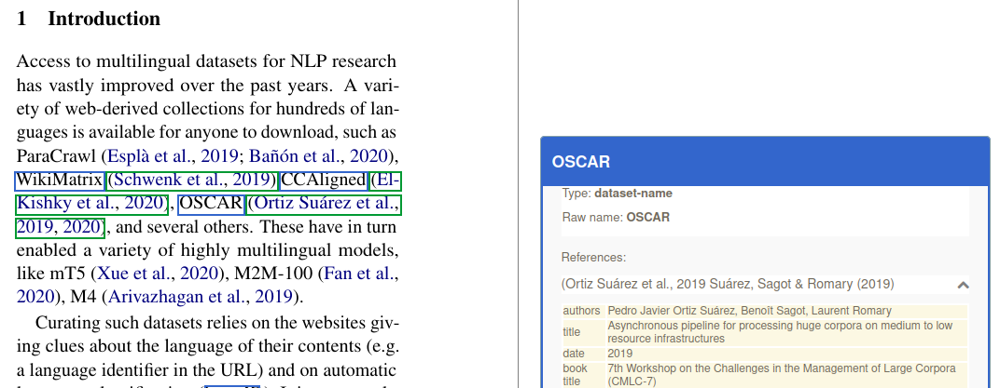

# DataStet

[](http://www.apache.org/licenses/LICENSE-2.0.html)

<!--
[](https://hub.docker.com/r/grobid/dataseer/ "Docker Pulls")
[](https://archive.softwareheritage.org/browse/origin/?origin_url=https://github.com/kermitt2/dataseer-ml)
-->

This is originally a fork from [dataseer-ml](https://github.com/dataseer/dataseer-ml). This extended version aims at identifying every mentions of datasets in scientific documents, including implicit mentions of datasets (introduction of data created/used in the research work, but not named) and explicitly named dataset. 

Most of the datasets discussed in scientific articles are actually not named, but these data are part of the disclosed scientific work and should be shared properly to meet the [FAIR](https://en.wikipedia.org/wiki/FAIR_data) requirements. Named dataset are particularly useful to evaluate the impact of a datasets in other research works and to credit researchers developing datasets as valuable scientific contributions (beyond just scholar publications).

Mentions of dataset are characterized automatically as _used_ or not in the research work described in the scientific document, _created_ and _shared_. 
The identified datasets are further classified in a hierarchy of dataset types, these data types being directly derived from MeSH.

The module can process a variety of scientific article formats, including mainstream publisher's native XML submission formats: PDF, TEI, JATS/NLM, ScholarOne, BMJ, Elsevier staging format, OUP, PNAS, RSC, Sage, Wiley, etc. PDF is considered as the "universal" scientific document format, but it is also the most challenging one. We use GROBID to process and structure efficiently and reliably PDF. 

The back-end service remain compatible with [dataseer-ml](https://github.com/dataseer/dataseer-ml) and the [DataSeer-Web application](https://github.com/dataseer/dataseer-web).  

Note: `.docx` format is also supported in a GROBID specific branch, but not yet merged. 




## Web API

### /service/annotateDatasetSentence

Identify the dataset information in a sentence and optionally disambiguate the extracted dataset mentions against Wikidata.  

|  method   |  request type         |  response type     |  parameters            |  requirement  |  description  |
|---        |---                    |---                 |---                     |---            |---            |
| GET, POST | `multipart/form-data` | `application/json` | `text`            | required      | the text to be processed |
|           |                       |                    | `disambiguate` | optional      | `disambiguate` is a string of value `0` (no disambiguation, default value) or `1` (disambiguate and inject Wikidata entity id and Wikipedia pageId) |

Response status codes:

|     HTTP Status code |   reason                                               |
|---                   |---                                                     |
|         200          |     Successful operation.                              |
|         204          |     Process was completed, but no content could be extracted and structured |
|         400          |     Wrong request, missing parameters, missing header  |
|         500          |     Indicate an internal service error, further described by a provided message           |
|         503          |     The service is not available, which usually means that all the threads are currently used                       |

A `503` error normally means that all the threads available to Softcite service are currently used for processing concurrent requests. The client need to re-send the query after a wait time that will allow the server to free some threads. The wait time depends on the service and the capacities of the server, we suggest 1 seconds for the `annotateDatasetSentence` service.

Using ```curl``` POST/GET requests with some __text__:

```console
curl -X POST -d "text=Insulin levels of all samples were measured by ELISA kit (Mercodia)." localhost:8060/service/annotateDatasetSentence
```

```console
curl -GET --data-urlencode "text=Insulin levels of all samples were measured by ELISA kit (Mercodia)." localhost:8060/service/annotateDatasetSentence
```

which should return this:

```json
{
  "application" : "datastet",
  "version" : "0.7.2-SNAPSHOT",
  "date" : "2022-06-15T12:25+0000",
  "mentions" : [ {
    "rawForm" : "Insulin levels",
    "type" : "dataset",
    "dataset" : {
      "rawForm" : "Insulin levels",
      "normalizedForm" : "Insulin levels",
      "offsetStart" : 0,
      "offsetEnd" : 14,
      "bestDataType" : "tabular data",
      "bestTypeScore" : 0.9956,
      "hasDataset" : 0.9976811408996582
    },
    "data-device" : {
      "rawForm" : "ELISA kit (Mercodia)",
      "normalizedForm" : "ELISA kit (Mercodia)",
      "offsetStart" : 47,
      "offsetEnd" : 67
    },
    "normalizedForm" : "Insulin levels",
    "context" : "Insulin levels of all samples were measured by ELISA kit (Mercodia)."
  } ],
  "runtime" : 0.901
}
```

Runtimes are expressed in milliseconds. 

#### /service/annotateDatasetPDF

|  method   |  request type         |  response type       |  parameters         |  requirement  |  description  |
|---        |---                    |---                   |---                  |---            |---            |
| POST      | `multipart/form-data` | `application/json`   | `input`             | required      | PDF file to be processed |
|           |                       |                      | `disambiguate`      | optional      | `disambiguate` is a string of value `0` (no disambiguation, default value) or `1` (disambiguate and inject Wikidata entity id and Wikipedia pageId) |

Response status codes:

|     HTTP Status code |   reason                                               |
|---                   |---                                                     |
|         200          |     Successful operation.                              |
|         204          |     Process was completed, but no content could be extracted and structured |
|         400          |     Wrong request, missing parameters, missing header  |
|         500          |     Indicate an internal service error, further described by a provided message           |
|         503          |     The service is not available, which usually means that all the threads are currently used                       |

A `503` error normally means that all the threads available to Softcite service are currently used for processing concurrent requests. The client need to re-send the query after a wait time that will allow the server to free some threads. The wait time depends on the service and the capacities of the server, we suggest 5 seconds for the `annotateDatasetPDF` service or 3 seconds when disambiguation is also requested.

Using ```curl``` POST request with a __PDF file__:

```console
curl --form input=@./src/test/resources/PMC1636350.pdf --form disambiguate=1 localhost:8060/service/annotateDatasetPDF
```

For PDF, each entity will be associated with a list of bounding box coordinates relative to the PDF, see [here](https://grobid.readthedocs.io/en/latest/Coordinates-in-PDF/#coordinate-system-in-the-pdf) for more explanation about the coordinate system. 

In addition, the response will contain the bibliographical reference information associated to a dataset mention when found. The bibliographical information are provided in XML TEI (similar format as GROBID). 


## Contact and License

Main author and contact: Patrice Lopez (<patrice.lopez@science-miner.com>)

The present software is distributed under [Apache 2.0 license](http://www.apache.org/licenses/LICENSE-2.0). The documentation is distributed under [CC-0](https://creativecommons.org/publicdomain/zero/1.0/) license.

If you contribute to this project, you agree to share your contribution following these licenses. 

## Acknowledgements

The development is supported by the BSO3 project, "France Relance" grant. 

The development of *dataseer-ml* was supported by a [Sloan Foundation](https://sloan.org/) grant, see [here](https://coko.foundation/coko-receives-sloan-foundation-grant-to-build-dataseer-a-missing-piece-in-the-data-sharing-puzzle/)


